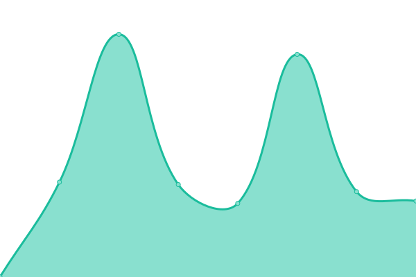

# [📈 Live Status](https://veselyjiri.github.io): <!--live status--> **🟥 Complete outage**

This repository contains the open-source uptime monitor and status page for [veselyjiri](https://veselyjiri.github.io), powered by [Upptime](https://github.com/upptime/upptime).

With [Upptime](https://upptime.js.org), you can get your own unlimited and free uptime monitor and status page, powered entirely by a GitHub repository. We use [Issues](https://github.com/veselyjiri/uptime/issues) as incident reports, [Actions](https://github.com/veselyjiri/uptime/actions) as uptime monitors, and [Pages](https://veselyjiri.github.io) for the status page.

<!--start: status pages-->
<!-- This summary is generated by Upptime (https://github.com/upptime/upptime) -->
<!-- Do not edit this manually, your changes will be overwritten -->
<!-- prettier-ignore -->
| URL | Status | History | Response Time | Uptime |
| --- | ------ | ------- | ------------- | ------ |
|  [www ČÚZK](https://www.cuzk.cz) | 🟥 Down | [www-cuzk.yml](https://github.com/veselyjiri/uptime/commits/HEAD/history/www-cuzk.yml) | 

 2586ms
     
 | 

<a href="https://veselyjiri.github.io/uptime/history/www-cuzk">90.44%</a>
    

|  [Nahlížení do KN](https://nahlizenidokn.cuzk.cz) | 🟥 Down | [nahlizeni-do-kn.yml](https://github.com/veselyjiri/uptime/commits/HEAD/history/nahlizeni-do-kn.yml) | 

 923ms
     
 | 

<a href="https://veselyjiri.github.io/uptime/history/nahlizeni-do-kn">90.36%</a>
    

|  [Dálkový přístup do KN](https://katastr.cuzk.cz/LoginDPWEB/login/Login.do?PAR_DestinateApplication=DalkovyPristup) | 🟥 Down | [dalkovy-pristup-do-kn.yml](https://github.com/veselyjiri/uptime/commits/HEAD/history/dalkovy-pristup-do-kn.yml) | 

 1579ms
     
 | 

<a href="https://veselyjiri.github.io/uptime/history/dalkovy-pristup-do-kn">89.95%</a>
    

|  [WMS KN](http://services.cuzk.cz/monitoring) | 🟥 Down | [wms-kn.yml](https://github.com/veselyjiri/uptime/commits/HEAD/history/wms-kn.yml) | 

 1386ms
     
 | 

<a href="https://veselyjiri.github.io/uptime/history/wms-kn">90.22%</a>
    

|  [WFS INSPIRE CPc](https://services.cuzk.cz/wfs/cp/epsg-5514/CP.2235132101) | 🟥 Down | [wfs-inspire-c-pc.yml](https://github.com/veselyjiri/uptime/commits/HEAD/history/wfs-inspire-c-pc.yml) | 

 2076ms
     
 | 

<a href="https://veselyjiri.github.io/uptime/history/wfs-inspire-c-pc">91.27%</a>
    

<!--end: status pages-->

[**Visit our status website →**](https://veselyjiri.github.io)

## 📄 License

- Powered by: [Upptime](https://github.com/upptime/upptime)
- Code: [MIT](./LICENSE) © [veselyjiri](https://veselyjiri.github.io)
- Data in the `./history` directory: [Open Database License](https://opendatacommons.org/licenses/odbl/1-0/)
